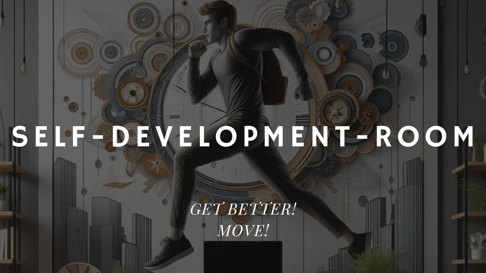

# Self Development Room

**Self Development Room** is a personal local website powered by a local PostgreSQL database.  
Its main purpose is to support your **growth journey** through structured and meaningful insights about your own life.

## 🧠 Current Features

- Local database (PostgreSQL)
- Two functional pages:
  - **Home**: Overview and quick access
  - **Language**: Language learning roadmap with lessons, progress tracking, and interactivity

## 🔮 What's Its Future?

This is just the beginning!  
New pages will be added, each focused on a key area of self-development:

- 📊 **Finance** – Track income, expenses, goals
- 📚 **Study** – Organize study routines, review content
- 🧭 **Career** – Plan your professional path
- 🧘‍♂️ **Lifestyle** – Daily habits, well-being metrics
- ✍️ **Journaling** – Reflection and mood tracking

## 🎯 What's Its Mission?

> To provide clear and accurate data to the user based on their **daily life** and **personal goals**,  
> turning self-awareness into action.

## 🚧 Development Notes

This project is under **active development**.  
It is running locally, not yet deployed, and used as a **personal productivity lab**.

Stay tuned for more updates and modules!
